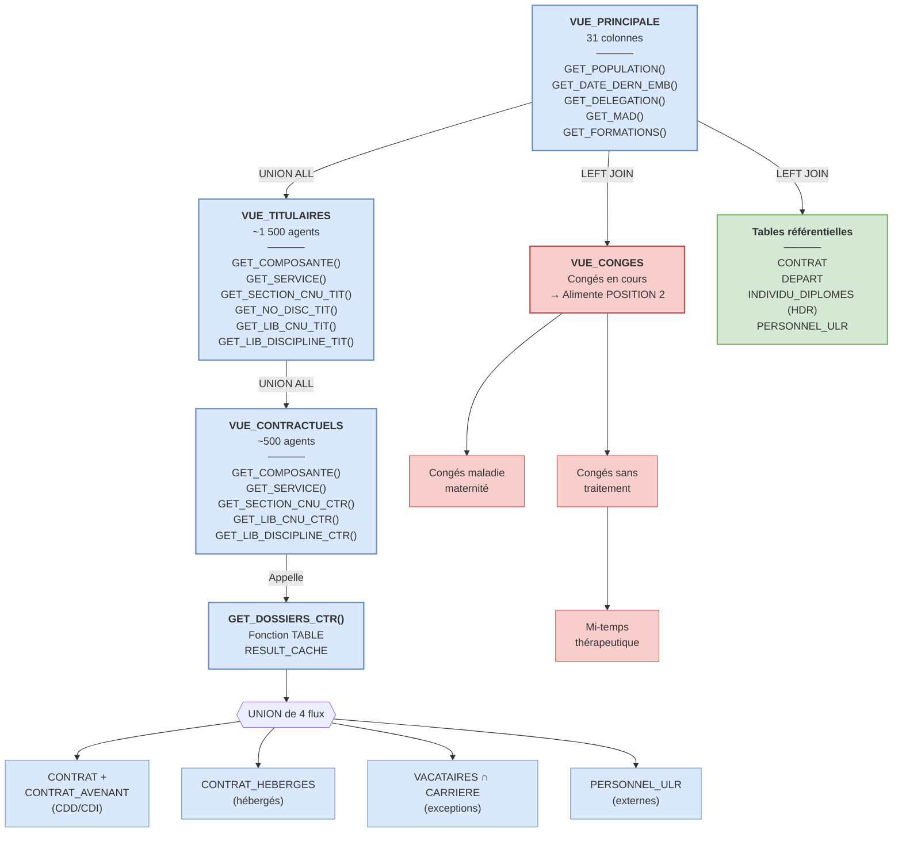

# Architecture — Cartographie GPEEC

## Vue d'ensemble

## Légende

| Couleur | Signification |
|---|---|
| 🔵 Bleu | Vues et fonctions PL/SQL (logique métier) |
| 🔴 Rouge | Données de congés |
| 🟢 Vert | Tables référentielles |

## Sources de données

| Alias dans la vue | Table/Vue source | Rôle |
|---|---|---|
| `ENS_AGT` | Union TITULAIRES + CONTRACTUELS | Données principales agents |
| `ENS_PRS` | PERSONNEL_ULR | Code poste, métadonnées (TXT_LIBRE) |
| `VUE_EMB` | CONTRAT | Date de 1ère embauche |
| `VUE_CDI` | CONTRAT | Date de passage CDI |
| `VUE_DEP` | DEPART | Date de départ |
| `VUE_HDR` | INDIVIDU_DIPLOMES | Habilitation à Diriger des Recherches |
| `VUE_CGE` | VUE_CONGES | Congés en cours |
